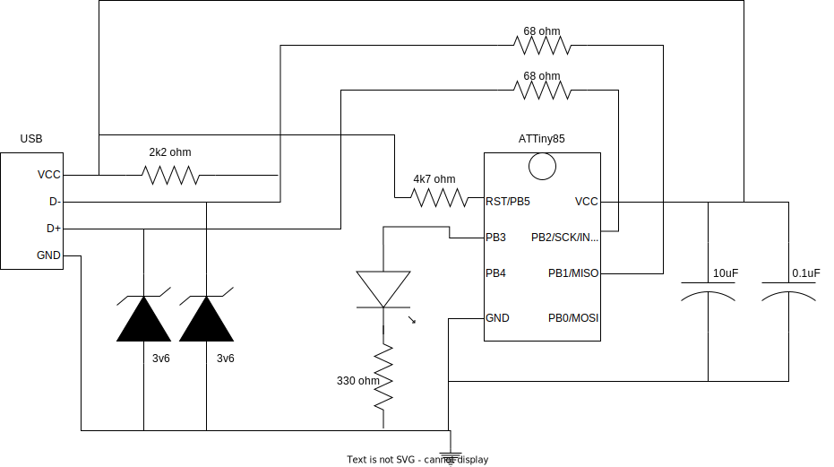

# LED USB device

This project is about a toy usb device, a re-implementation of the [codeandlife tutorial](https://codeandlife.com/2012/01/22/avr-attiny-usb-tutorial-part-1/).
The usb devices is powered by [V-USB](https://www.obdev.at/products/vusb/index.html), a USB implementation in software for Atmel micro-controllers.

This project is made of:
 * a hardware part
 * a firmware part
 * a driver part

For the programming of the Atmel micro-controller, the AVR pocket programmer is a good choice.

## Hardware setup

Bill of materials:
 * 1x ATTiny85
 * 1x LED
 * 2x 3.6V zener diodes
 * 1x 10uF electrolytic capacitor
 * 1x 0.1uF ceramic capacitor
 * 2x 68 ohm resistor
 * 1x 330 ohm resistor
 * 1x 2200 ohm resistor
 * 1x 4700 ohm resistor
 * 1x usb cable
 * 1x AVR programmer
 * (optional) 1x pin header for the usb cable




## Software setup

The build chain is expecting AVR GCC and libusb.

```
$> make # builds both firmware and driver
$> make fuse # sets the fuses of the ATTiny85 to work with internal oscillator at 16.5 MHz
$> make flash # uploads the firmare
```

## Usage

```
$> sudo ./usb_led on
$> sudo ./usb_led off
```
